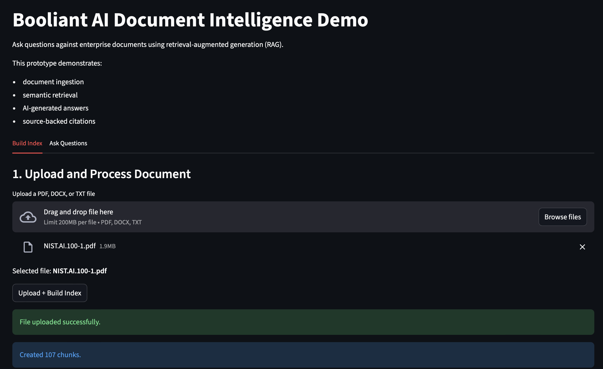
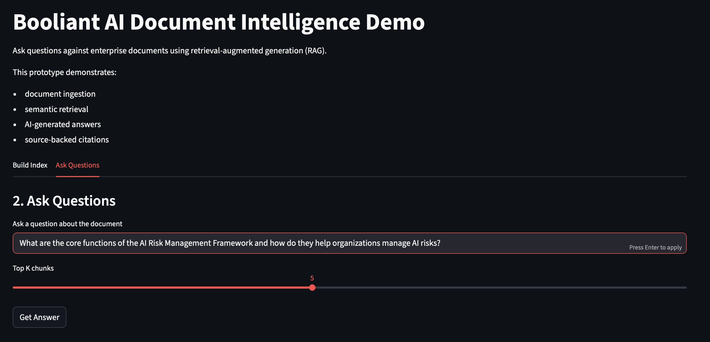
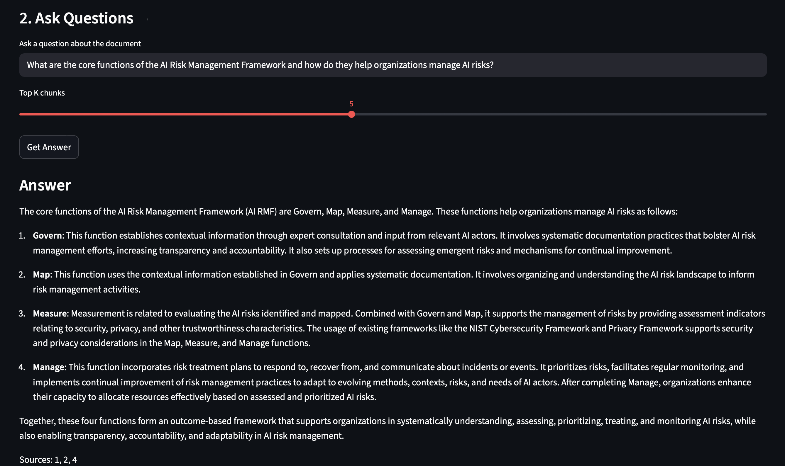
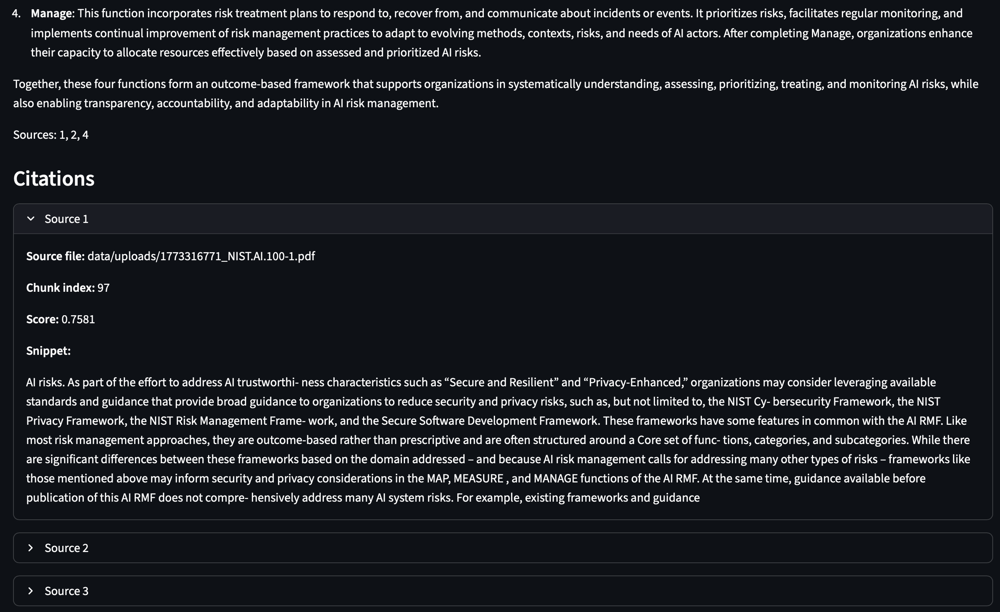

# Booliant AI Document Intelligence Demo

This project demonstrates a simple Retrieval-Augmented Generation (RAG) system that allows users to upload enterprise documents and ask questions using AI.

The system retrieves relevant sections of the document and generates answers backed by source citations.

This prototype illustrates how AI can be used to build intelligent knowledge assistants for enterprise documents such as policies, technical manuals, compliance frameworks, or research papers.

---

## Demo

### Upload Document

### Ask Question

### AI Answer with Citations
  
  

Example workflow:

1. Upload a document
2. Build the vector index
3. Ask questions about the document
4. Receive AI-generated answers with supporting citations

---

## Features

- Document upload and ingestion
- Automatic text extraction from PDFs
- Intelligent document chunking
- Vector embeddings using OpenAI
- Semantic search using FAISS
- AI-generated answers with source citations
- Interactive Streamlit user interface

---

## Architecture

Document Upload
↓
Text Extraction
↓
Chunking
↓
Embedding Generation (OpenAI)
↓
Vector Index (FAISS)
↓
Semantic Retrieval
↓
AI Answer Generation with Citations

---

## Tech Stack

- Python
- FastAPI
- Streamlit
- FAISS vector database
- OpenAI embeddings
- OpenAI language models

---

## Project Structure

booliant-rag-demo
│
├── app
│ ├── main.py
│ ├── indexing.py
│ └── chunking.py
│
├── streamlit_app.py
├── requirements.txt
├── README.md
└── .gitignore

---

## Running the Project Locally

### 1. Install dependencies

pip install -r requirements.txt

### 2. Set your OpenAI API key

export OPENAI_API_KEY="your-api-key"

### 3. Start the FastAPI backend

uvicorn app.main:app --reload

Backend will run at:

http://127.0.0.1:8000

API documentation:

http://127.0.0.1:8000/docs

### 4. Start the Streamlit interface

streamlit run streamlit_app.py

Streamlit UI will run at:

http://localhost:8501

---

## Example Questions

Try asking questions like:

- What are the key policies described in this document?
- What responsibilities do organizations have according to the framework?
- What risks related to AI systems are discussed?
- What are the core functions described in this document?

---

## Example Use Cases

This architecture can be applied to:

- enterprise knowledge assistants
- policy and compliance analysis
- technical documentation search
- research document exploration
- internal knowledge bases

---

## Important Note

This project is a prototype designed to demonstrate the architecture of a document intelligence system using Retrieval-Augmented Generation (RAG).

It is intended for experimentation and learning purposes.

---

## License

MIT License