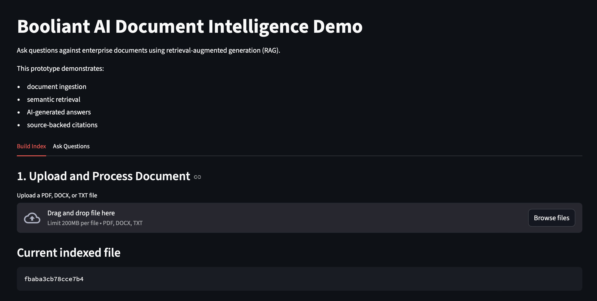
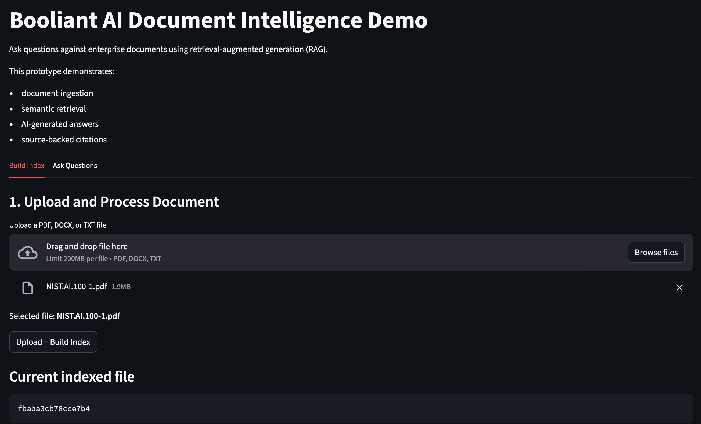
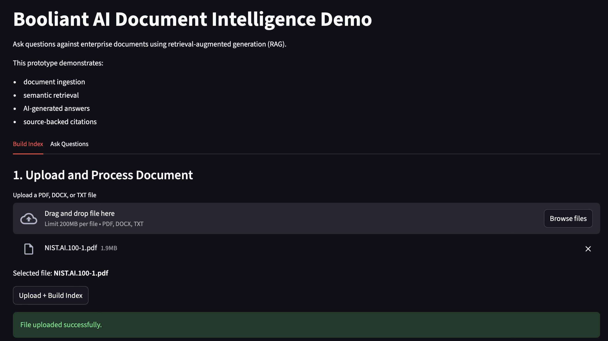

# Booliant AI Document Intelligence Demo

AI-powered document intelligence system that allows users to upload documents and ask questions with source-backed answers.

## 🚀 Live Demo

👉 http://3.236.78.215:8501

## 🧠 What it does

- Upload documents (PDF, TXT)
- Build semantic index
- Ask natural language questions
- Get answers with citations

## 🏗️ Tech Stack

- FastAPI (backend APIs)
- Streamlit (UI)
- FAISS (vector search)
- OpenAI embeddings + LLM

## 📸 Demo

### Upload Document

### Ask Question

### AI Answer with Citations

## ⚠️ Note

This is a demonstration system. Uploaded files are processed temporarily and not intended for sensitive or production data.